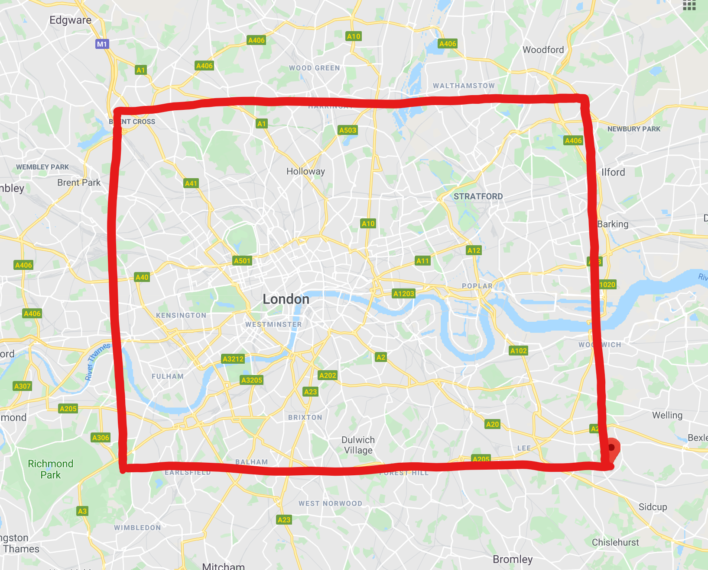

# Get traffic

This Azure Function is using a `TimerTrigger` which schedules the Python script execution every hour. 

## What it's doing

This function is generating random departure and arrival coordinates to simulate itineraries in London. The coordinates are generated in the area squared below, which are defined by the variables `maxLatitude`, `minLatitude`, `maxLongitude` and `maxLongitude`.

The Azure Maps `GET route directions` batch [API](https://docs.microsoft.com/en-us/rest/api/maps/route/postroutedirectionsbatch) is called with these itineraries as parameters and the result is stored as a CSV file in a blob storage. The collected information are : 
lengthInMeters, travelTimeInSeconds, trafficDelayInSeconds, departureTime, arrivalTime,noTrafficTravelTimeInSeconds ,historicTrafficTravelTimeInSeconds, liveTrafficIncidentsTravelTimeInSeconds,departureLatitude, departureLongitude, arrivalLatitude, arrivalLongitude.

## How to use it

The chron trigger and the Blob storage binding are configured in the [function.json](function.json) file.

Click [here](https://docs.microsoft.com/en-us/azure/python/tutorial-vs-code-serverless-python-01) for more information on Azure Functions in Python.
