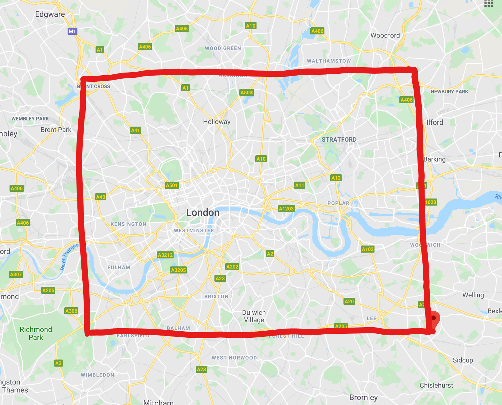

# Azure Function for traffic information collection

These Azure Functions are using a `TimerTrigger` which schedules Python scripts executions every hour. 

## What it is doing

Thes functions are generating random departure and arrival coordinates to simulate car itineraries in London, Tallin, Lagos, Nairobi, Bucharest & Johannesburg. The coordinates are generated in  squared areas, like for the London map below. The area is defined by the variables `maxLatitude`, `minLatitude`, `maxLongitude` and `maxLongitude`.

The Azure Maps `GET route directions` batch [API](https://docs.microsoft.com/en-us/rest/api/maps/route/postroutedirectionsbatch) is called with these itineraries as parameters and the result is stored as a CSV file in a Blob storage. The collected information are : 
lengthInMeters, travelTimeInSeconds, trafficDelayInSeconds, departureTime, arrivalTime,noTrafficTravelTimeInSeconds ,historicTrafficTravelTimeInSeconds, liveTrafficIncidentsTravelTimeInSeconds,departureLatitude, departureLongitude, arrivalLatitude, arrivalLongitude.

## How to use it

The chron trigger and the Blob storage binding are configured in the [function.json](function.json) file.

Click [here](https://docs.microsoft.com/en-us/azure/python/tutorial-vs-code-serverless-python-01) for more information on Azure Functions in Python.
