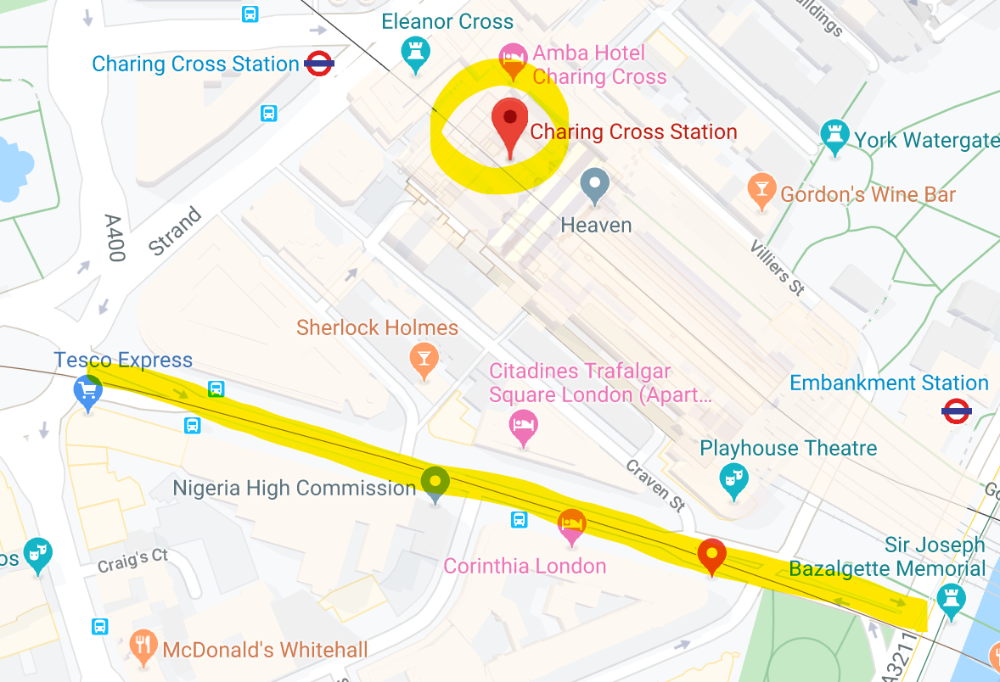

# Azure-Maps-traffic
Test of Azure Maps traffic API

## Observation
- The Azure Maps API is very bounded to the Azure Maps interface : for the traffic tile API the coordinates have to be re-calculated to fit the zoom level
- `Get traffic flow segment` returns the traffic for a few coordinates points which seem to be a road fragment. However the chosen road fragment changed according to the zoom level, there is no indication on how this road has been selected.
- `Get traffic flow tile` return only **png and pbf** , thus the data cannot be used for further analysis.

## Traffic flow segment API
The coordinates \[51.50753,-0.12386\] (Charing Cross Station, London) have been used. 
- **Zoom 14**: with a zoom of 14, the [json output](traffic-flow-segment/output-zoom14.json)  points to a street close to the search point.
 
- **Zoom 10**: with a zoom of 10, the [json output](traffic-flow-segment/output-zoom10.json)  points to a street a bit further to the search point.
 
- **Zoom 5**: 5 was the minimum zoom level that could be used without an error message - although the documentation says a range of 0 to 22 is acceptede. The [json output](traffic-flow-segment/output-zoom10.json) points to a road very far from the search point.
 

## Traffic flow tile API
The coordinates \[51.50753,-0.12386\] had to be recalculated as tiles coordinates, matching the zoom level.
The output is either a png or a pbf file.
 